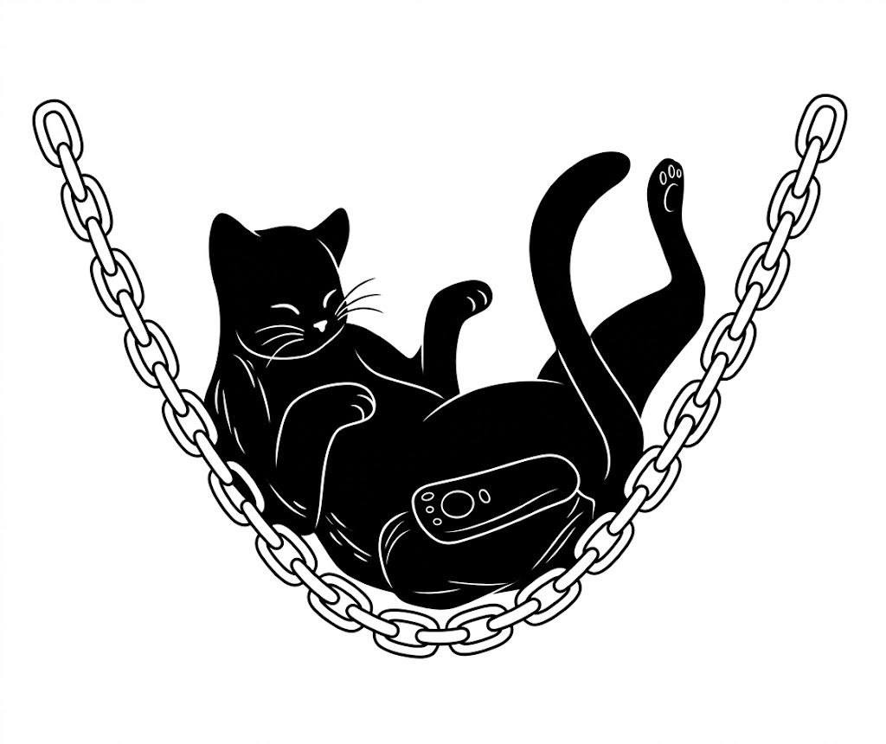

# catplot

Software for catenary analysis

⚠️WIP⚠️~currently suspended due to exams at UNIPI Physics :)

## How does it work

Using the OpenCV library, the initial image is cleaned. All the contours detected by the program are then searched for, organized from largest to smallest, and printed in green. The user selects n contours from the selection (the largest n contours will be displayed individually) and views each of these n contours one at a time, looking for possible errors (i.e., elements of the original photo identified as part of the catenary but which are actually just noise). Once the IDs of the incorrect contours have been saved and the program is restarted, the coordinates of these selected points (or marked in red) will be saved. The fit is then performed from these points.

For any problem or request create an issue or contact me on m.leonardi16@studenti.unipi.it

## Report

[Download Report](report/main.pdf)

## Relese Notes

|version|.|month|.|relese|
- Beta 0.5.1 The selection of the borders must be made manually and the user need to modify the code
- Beta 0.7.2 Filters now can be chosen in the dialog window
- Beta 0.7.2 The selection of the borders now can be made directy on the dialog window