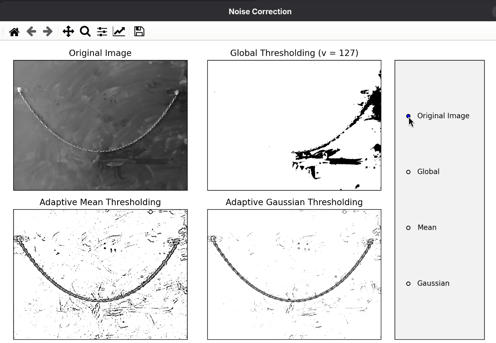
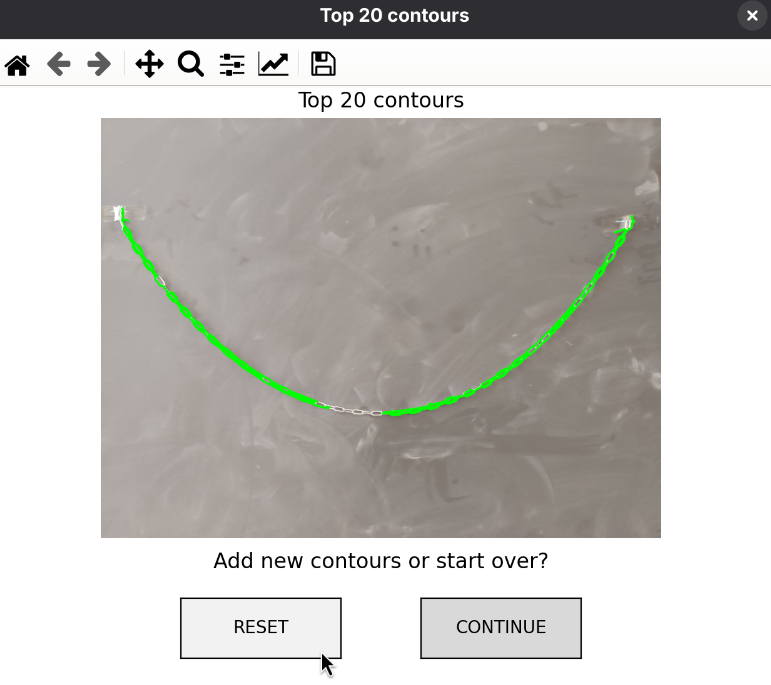
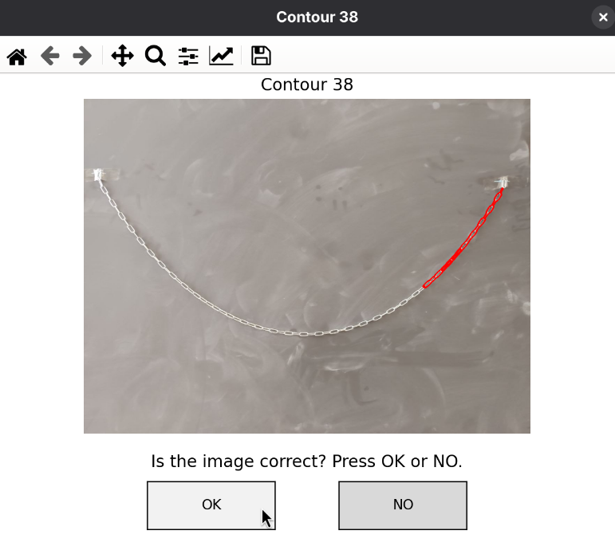

# catplot

 ~ By Kappa Cabras

Software for catenary analysis.

⚠️WIP⚠️ ~ currently suspended due to exams at UNIPI Physics :)

## How does it work

Using the OpenCV library, the initial image is cleaned. All the contours detected by the program are then organized from largest to smallest and drawn in green. The user selects the top *n* contours from the selection (the largest *n* contours will be displayed individually) and views each of them one at a time, looking for possible errors (i.e., elements of the original photo identified as part of the catenary that are actually just noise). Once the incorrect contours have been discarded by the user, the coordinates of the valid points (marked in red) will be saved automatically. The fit is then performed from these points.

For any problems or requests, please create an issue or contact me at m.leonardi16@studenti.unipi.it

## Report

[Download Report](report/main.pdf)

## How to use it

### Bash command

```Bash

py image_analyzer.py <file_path_start_image> <number_of_selected_borders>

```

**EXAMPLE**

```bash

py image_analyzer.py exaples/exp1.jpg 20

```

### Filter selection



Clik on the corresponding filter and close the Tab. 3 new tabs will appear:

- ''edge detection': show the user how the edges have benn detected
- ''All contours'': show all the detected edges
- ''Top *n* contours'': show the user the biggest *n* contours detected, where *n* is "<number_of_selected_borders>"



Choose:
- ''Reset'': to erase to start over from scratch the border selection
- ''Continue'': to keep the previously discarded borders

### Border selection



Now for every border the user need to chose if the highlighted border(''ok'') is part of the catenary or is noise(''no'')

### Fit

```bash

py catenaryFIT.py <file_path_start_image>  <True/False>

```

**EXAMPLE**

```bash

py catenaryFIT.py exaples/exp1.jpg False

```

Where "<file_path_start_image>" is the same as before. The boolean parameter let the user choose between: just show the fit as a window(''False'') or save the fit as a pgf file(''True??)

## Relese Notes

|version|.|month|.|relese|
- Beta 0.5.1 The selection of the borders must be made manually and the user need to modify the code
- v 1.7.0 Filters now can be chosen in the dialog window
- v 1.7.0 The selection of the borders now can be made directy on the dialog window
- v 1.7.0 Added a reset button
- v 1.7.0 Transalated in Eanglish